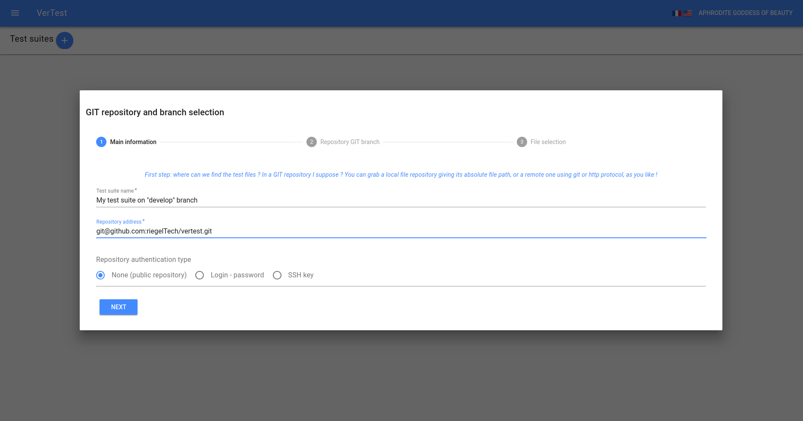
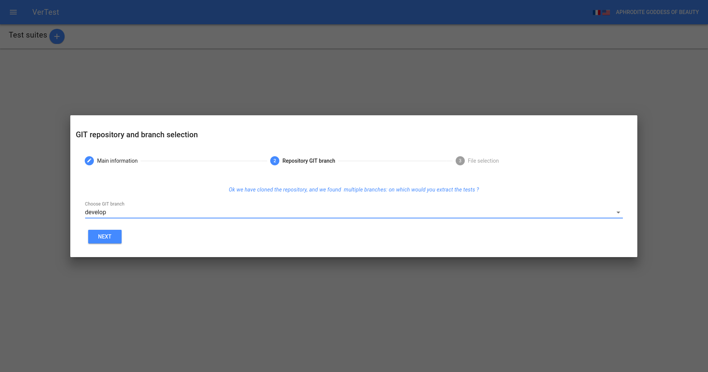
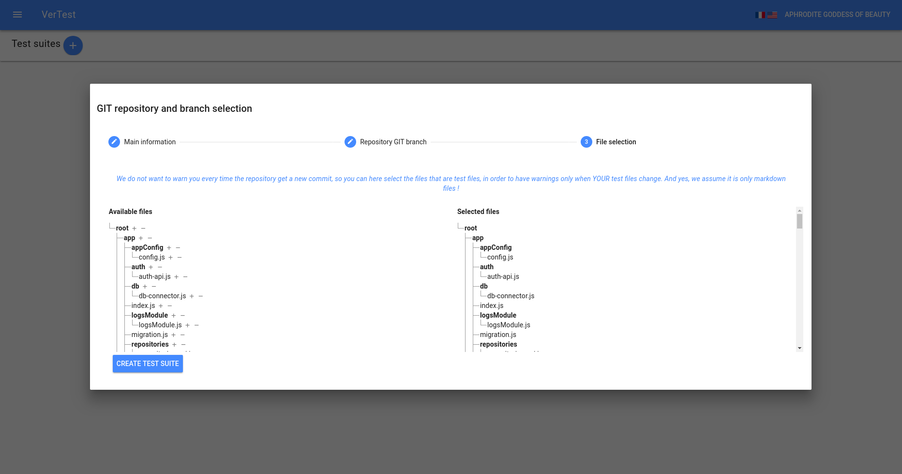
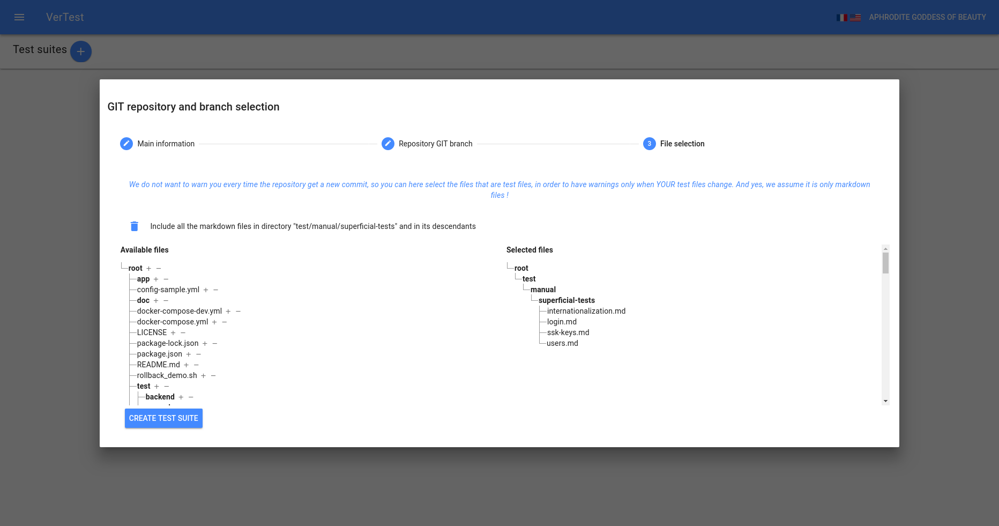

# Creating a test suite step by step

## Prepare the credentials

It is highly probable that your GIT repository has restricted access, so if your GIT repository uses
SSH keys for authentication, please refer to [SSH keys management](./manage-ssh-keys.md) before.

## Step 1: access to GIT repository

The three types of supported GIT repository address are :

* SSH address (needs a valid SSH key)
* HTTP address (requires maybe a couple login / password)
* local file system

> Note: the local file system should be used only for tet purpose, as it can contains partial
> GIT repository collection of objects, and obviously is less secure than remote protocols.

At this point, the GIT repository is cloned into a temporary directory, to get all the
available GIT branches and give you the choice.

## Step 2: choosing the branch

> Note: you will be able to change the GIT branch even after the test suite creation.

## Step 3: selecting the files to track and display

The files are displayed in two trees: the left tree contains all the repository files, and the right
tree contains the result of your selector.

> Note: you can fold / unfold the folder by clicking on it

The left tree contains also selectors in front of each folder and file (the `-` and `+` signs).

To select all the markdown files under a folder, click on the `+` corresponding sign.
Then if you want to exclude some file of this folder, you can add an excluding selector by clicking
on the `-` sign in front of these files or folders.

The selectors are interpreted in the order they appear. Each selector appear on top of the trees, and 
you can remove them individually.

> Note: by default, if you do not create any selector, all the markdown files will be included

> Note: all folder selectors are deep, so selecting all the files under `./my-folder/` will also
> select all the MD files under all descendants: `./my-folder/deep-folder/*`

> Note: you will be able to change the file selector even after the test suite creation.

Once done, click on "finish" button.
