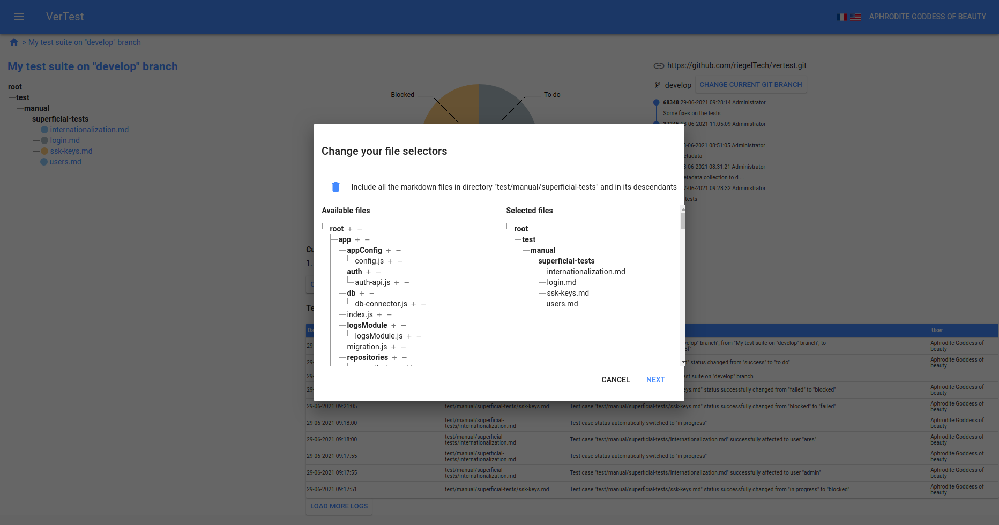
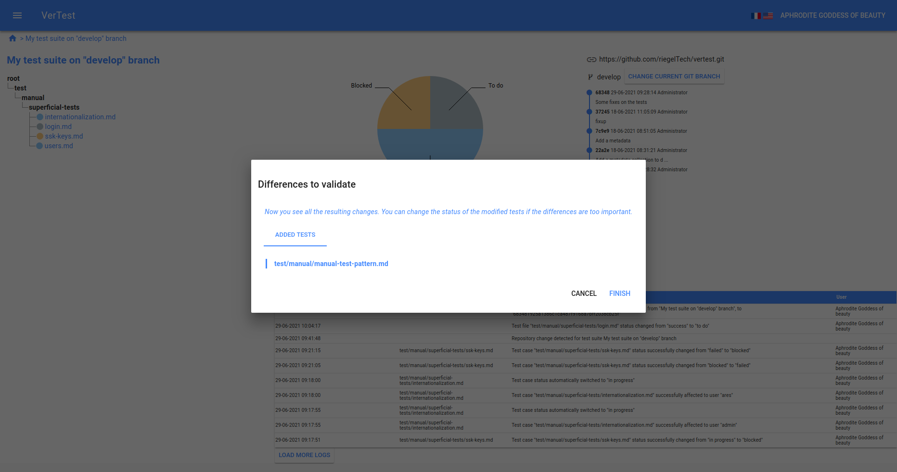

# Changing the file selector of a test suite

VerTest allows you to change the file selector of a test suite. This is very interesting when you want
to move or add files in the GIT repository and integrate them in the test suite.

To perform such modification, just click on the `Change current file selection` button.

## First step: file selector modification

This step reproduces exactly the third step of the test suite creation [test suite creation, step 3](create-test-suite.md#Step-3:-selecting-the-files-to-track-and-display)

When you are fine with the new selector, just click on `Next` button.

## Second step: final validation

This step gives you a better control on what will happen once validated.

The diff is very similar to [the GIT modification validation](git-branch-modification.md#What-if-the-branch-are-so-different-that-test-files-change-?)
one, except that there will be no file modification, but only addition and deletions.

When you are fine with the result, just click on the `Finish` button.
