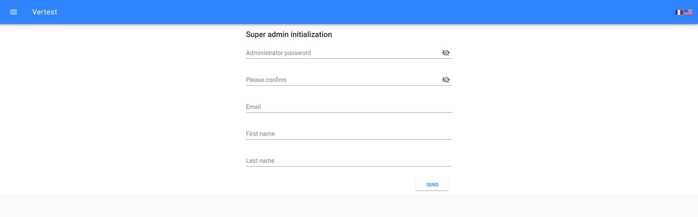

# First start of VerTest

```bash
$ docker-compose up
```

You can now open URL `http://localhost:[CONFIGURED_PORT]` in your browser.

As users database is empty, you will be redirected to URL `http://localhost:[CONFIGURED_PORT]/#/[LANG]/init/`, so you can define
super-user password.



> Note that the password must have at least 8 characters to be valid.

Super-user login is **admin**. There is only one super-user, and it is the only user allowed to create, edit
or delete all other users.

> Note that once super admin is initialized, you can edit but not delete it.

Once initialized, the application will redirect you to login page.
