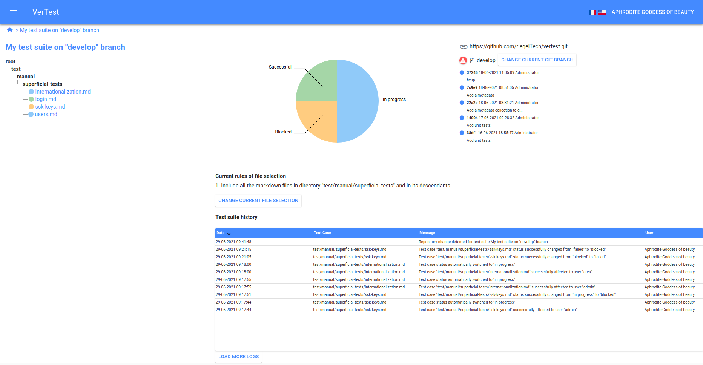

# Changing the GIT branch of a test suite

## When do I have to change the GIT branch ?

When development team finishes a feature, they commonly merge the feature branch into `develop` or `master`
branch, and often delete the branch after that.

It is the first case in which you will have to switch to another branch.
VerTest will warn you about a deleted branch in test suites grid and in the test suite page.

The second case is when you missed something at the test suite creation, errors happen, so no need to
restart the test suite creation. Just click on the `Change current GIT branch` button on the GIT panel,
in the top-right corner.

## What if the branch are so different that test files change ?

When you click on the button, a GIT diff validation window appears, as explained in the previous section
[Handle a GIT modification](git-modification.md).

The actions and consequences are exactly the same.
