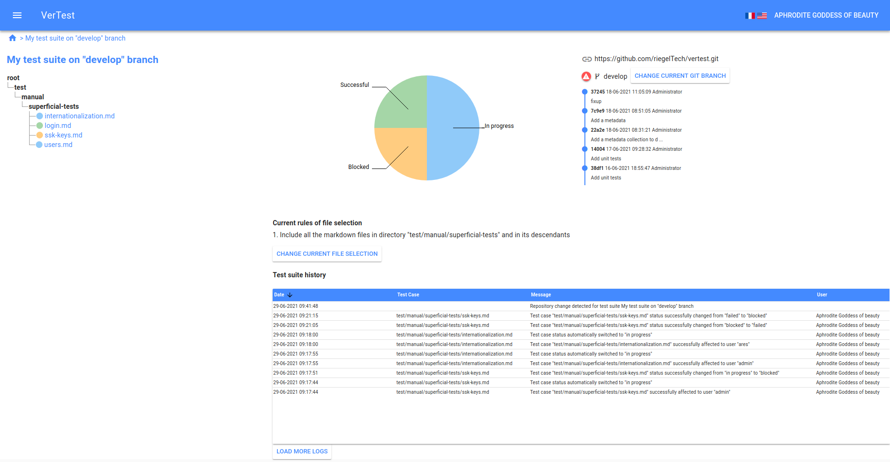

# Handle a GIT modification on test files

## Visualization

When you are on the home page (test suite's grid), when a test suite requires an action,
you will see a warning red symbol on the corresponding row:

Then accessing to the test suite page, you can see a similar symbol on the "GIT" panel
on the top-right dashboard screen:

Clicking on the warning symbol will display the resolution window.

## Remediation

On the resolution window, each modified test file appears, and you can visualize the modifications
as a GIT diff.

Each test file has also its status displayed, and you can modify this status.

In our example, the first test file `internationalization.md` have many differences between its previous
version. In this case, we would probably chang its status to indicate that the test must be redone.

In opposition, some test files have been most probably modified for typo correction purpose, so their
status should not be modified.

It appears that `ssh-keys.md` and `users.md` have minor modifications, unlike `login.md` whose modification
adds an important precision. Consequently, you should switch its status from `Successful` to `In progress`.

> Note: added of deleted test files appears on two dedicated tabs, but you cannot modify their statuses:
> added files will automatically switch to default status

## Last step

When you are satisfied with the new statuses, you can click on the `Finish` button: the new statuses
will be automatically propagated, and the repository will update to be on the new commit.
