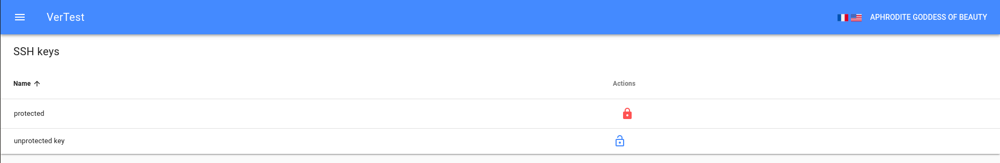

# How to manage the SSH keys ?

A common way to access to a GIT repository is to using SSH keys.

SSH keys are asymmetric, so when you generate one, it produces a couple of keys. One is public and can be
given to anyone. The private part is commonly locked with a passphrase and must stay to your end (and ideally
protected).

This allows you to pull / push 
on the repository only if:

* you have the corresponding private SSH key
* the repository owner uploads a copy of the corresponding SSH public key

The secured SSH protocol requires both of public and private keys, but it would be insecure to ask you to copy
your private key at the root directory of the application.

## Where do I should store my private SSH key

In most of cases, and particularly on Linux systems, the keyring stand on `/home/[YOUR USER]/.ssh/`. I strongly
recommend to not move your keys outside this folder.

So to add a key, you have to reference it on the configuration file, as explained 
in [configuration documentation](configuration.md).

The only thing that you have to take care of is to give the read rights on keys to the user that will execute the
application.

## My private key has a passphrase, do I should copy it in a unlocked version ?

No, this is strongly not recommended. The application will shows you the locked keys to enter their
passphrase, by clicking on the red locker icon.

> Note: to not take a risk of leak, the passphrase is not stored by the application, that means
> that every time you restart the application, you will have to enter the passphrase again.
