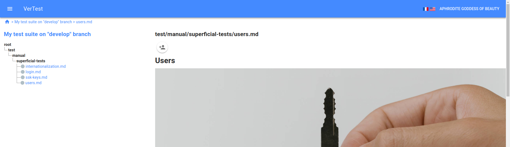
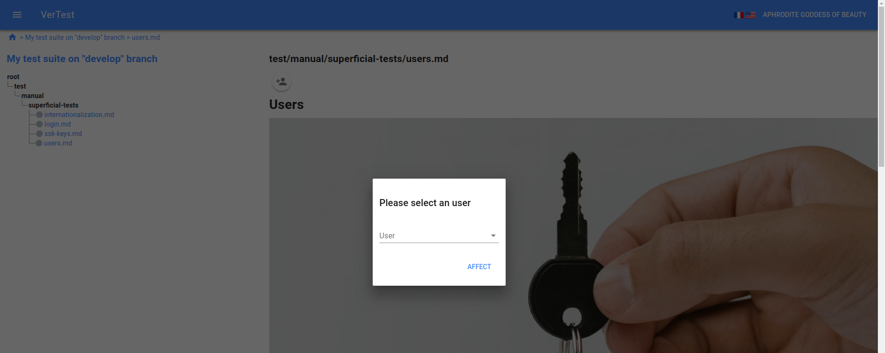
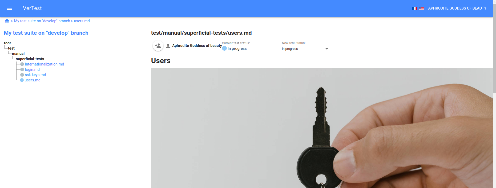

# Passing a test

## Affect a user on the test

First you have to affect a user on the test, clicking on the corresponding button just under the test case
file path.

> Note: when you affect a user, the test will automatically switch its status from the default one to the 
next one.

## The affected user can change the test status

Once a user is affected, he can (and only him) modify the test status.

