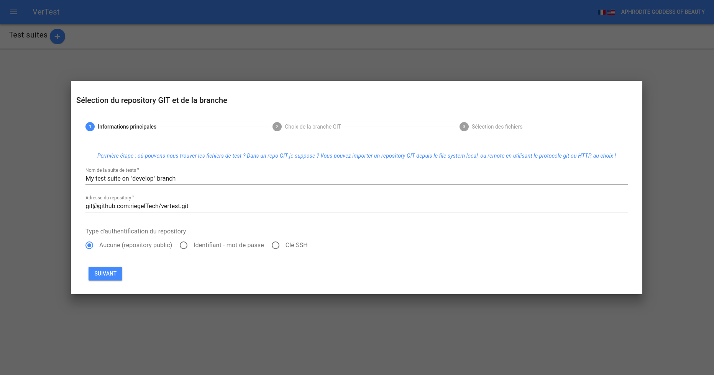
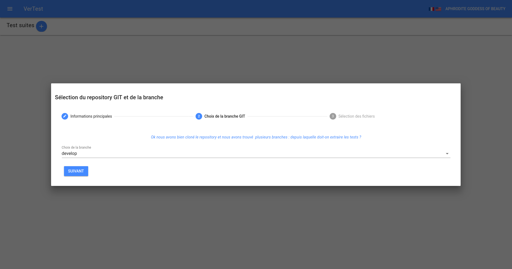
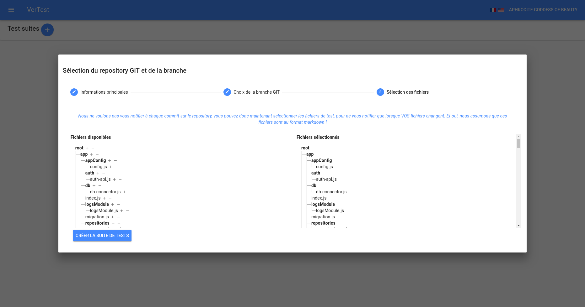
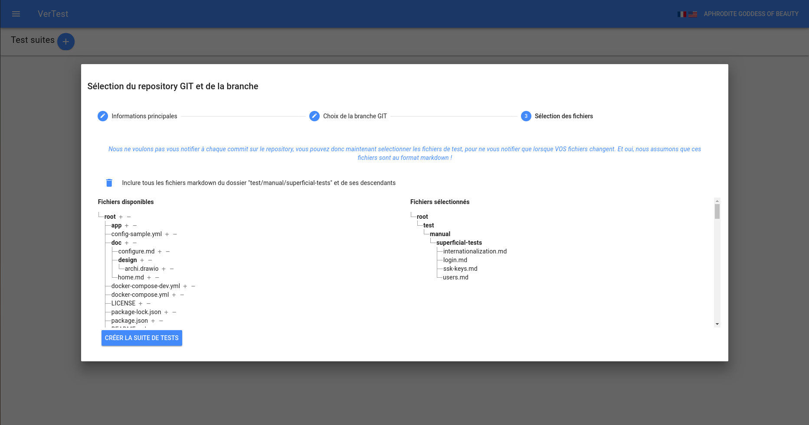

# Créer une suite de tests pas à pas

## Préparer les accès

Il est hautement probable que votre repository GIT ait des accès protégés, et s'il utilise des clés SSH,
veuillez vous référer à la section sur [la gestion des clés SSH](manage-ssh-keys.md) avant d'entamer
la présente section.

## Étape 1 : accès au repository GIT

VerTest supporte trois types d'adresses de repository GIT :

* adresse utilisant le protocole SSH (nécessite une clé SSH valide)
* adresse HTTP (nécessite parfois un login / mot de passe)
* chemin vers un emplacement sur le disque en local

> Note : le chemin local ne devrait être utilisé qu'à des fins de test de l'application,
> car souvent le repository GIT ne contient pas tous les objets GIT disponibles, et est évidemment
> moins sécurisé que les protocoles réseau.

Lors de la validation, le repository est cloné dans un répertoire temporaire, ce qui permet de récupérer
toutes les branches GIT disponibles et vous en donner le choix.

## Étape 2 : choisir la branche

> Note : vous pourrez changer de banche GIT même après la création de la suite de tests.

## Étape 3 : sélectionner les fichiers de test à afficher et à tracker

Les fichiers sont affichés dans deux arborescences : celle de gauche représente l'ensemble des 
fichiers disponibles, celle de droite représente les fichiers retenus par votre sélecteur.

> Note: vous pouvez plier / déplier les dossiers en cliquant dessus

L'arborescence de gauche contient aussi des sélecteurs en face de chaque dossier et fichier,
sous la forme de signes `-` et `+`.

Pour sélectionner tous les fichiers markdown sous un dossier, cliquez sur le `+` du dossier.
Si vous souhaitez ensuite exclure des fichiers de ce dossier, vous pouvez créer un sélecteur
d'exclusion en cliquant sur le signe `-` en face de ces fichiers ou dossiers.

Les sélecteurs sont interprétés dans l'ordre dans lequel ils apparaissent. Chaque sélecteur apparaît
au-dessus des arborescences, et vous pouvez les supprimer individuellement.

> Note: par défaut, en l'absence de sélecteur, tous les fichiers seront sélectionnés

> Note: tous les sélecteurs de dossier agissent en profondeur, donc sélectionner tous les fichiers de 
> `./my-folder/` sélectionnera aussi les fichiers présents dans ses descendants : `./my-folder/deep-folder/*`

> Note: vous pourrez modifier les sélecteurs de fichiers y compris après la création de la suite de tests.

Une fois le résultat voulu obtenu, cliquez sur le bouton "Terminer".
