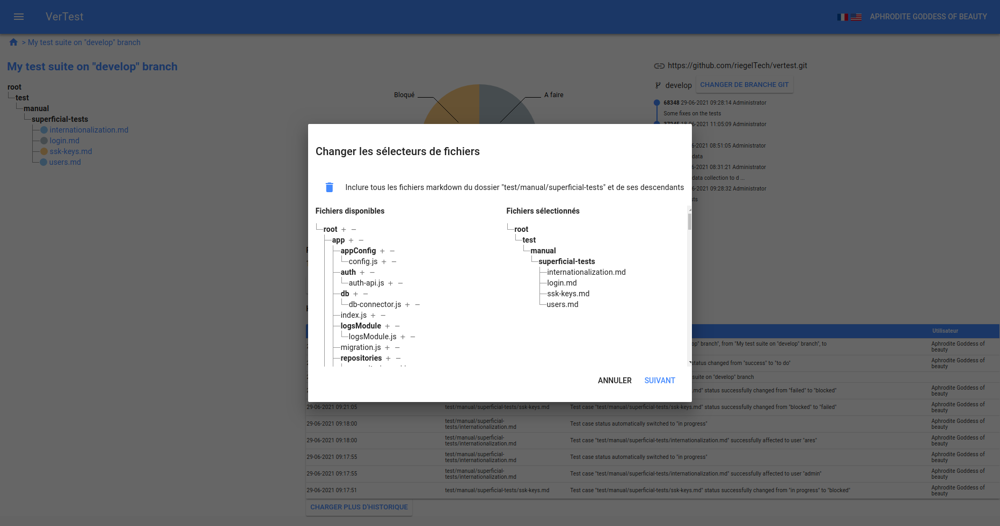
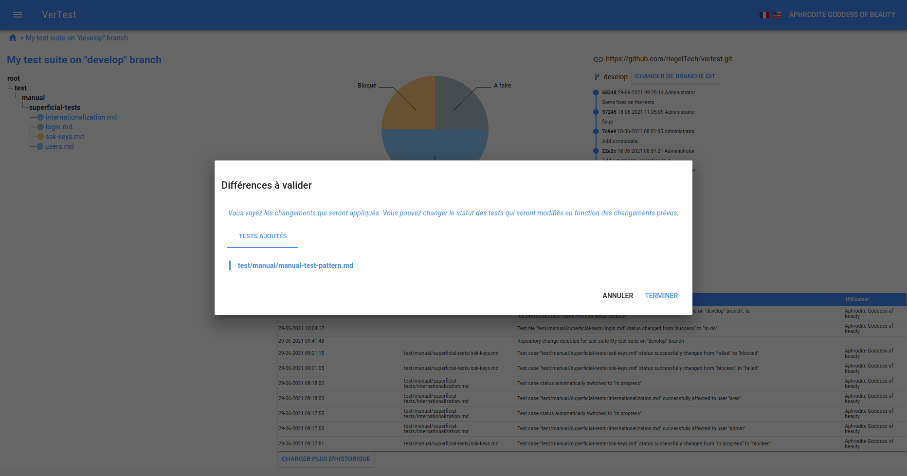

# Changer les sélecteurs de fichiers

VerTest vous permet de modifier les sélecteurs de fichier d'une suite de test.
C'est très utile quand on ajoute ou déplace des fichiers de test et que l'on veut les intégrer à la suite
de tests.

Pour faire cette manipulation, cliquez sur le bouton `Changer les sélecteurs de fichiers de tests`.

## Première étape : modification des sélecteurs de fichiers

Cette étape reproduit exactement la [troisième étape de la création d'une suite de tests](create-test-suite.md#Étape-3-:-sélectionner-les-fichiers-de-test-à-afficher-et-à-tracker)

Quand vous êtes satisfait du résultat, cliquez sur `Suivant`.

## Seconde étape : validation finale

Cette étape vous permet de bien contrôler ce qui va résulter après validation.

Le différentiel affiché est très similaire au 
[différentiel GIT de modification de branche](git-branch-modification.md#Que-faire-si-les-différences-sont-trop-importantes-entre-les-branches-?)
à ceci près qu'il n'y a aucune modification, mais uniquement des ajout et suppressions de fichiers.

Lorsque le résultat vous satisfait, cliquez sur le bouton `Treminer`.
