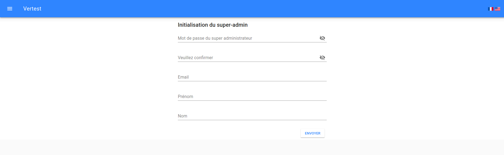

# Premier démarrage de VerTest

```bash
$ docker-compose up
```

VerTest est accessible dans votre navigateur à l'adresse `http://localhost:[CONFIGURED_PORT]`.

Comme la base de données est vide, vous serez redirigé vers `http://localhost:[CONFIGURED_PORT]/#/[LANG]/init/`,
vous pourrez alors définir le mot de passe du super-administrateur.



> Notez que la mot de passe doit contenir au moins 8 caractères pour être valide

L'identifiant du super admin est  **admin**. Il n'y a qu'un seul super admin, et il est le seul à pouvoir
créer, modifier ou supprimer d'autres utilisateurs.

> Notez que lorsque le super admin est initialisé, vous pourrez le modifier mais pas le supprimer.

Une fois initialisée, l'application vous redirigera vers la page de login.
