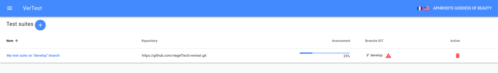
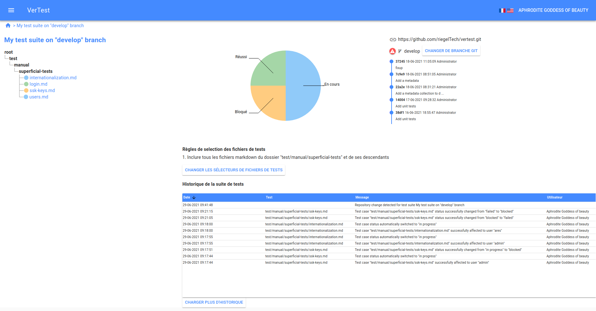

# Changer de branche GIT sur une suite de tests

## Quand devrais-je changer de branche GIT ?

Quand l'équipe en charge du développement termine une fonctionnalité, en général elle fusionne la branche
contentant la fonctionnalité dans la branche `develop` ou `master` et supprime parfois
la branche d'origine.

C'est le premier cas dans lequel vous aurez à changer de branche.
VerTest vous prévient lorsque la branche d'origine est supprimée, à l'aide d'un picto rouge dans la
grille des suites de test et sur la page de chaque suite de test.

Le second cas c'est quand vous avez fait une erreur lors de la création de la suite de tests. Pas besoin
alors de tout recommencer, il suffit de cliquer sur le bouton `Changer de branche GIT` en haut à droite.

## Que faire si les différences sont trop importantes entre les branches ?

Lorsque vous cliquez sur ce bouton, une fenêtre apparaît qui présente les différences sur chaque fichier
à la façon d'un différentiel GIT, comme expliqué dans la section précédente
[Gérer une modification GIT](git-modification.md).

Les tenants et aboutissants sont exactement les mêmes.
