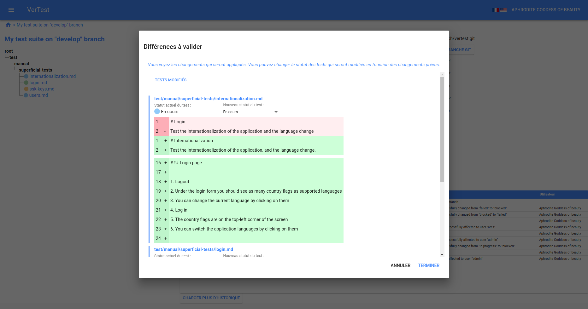
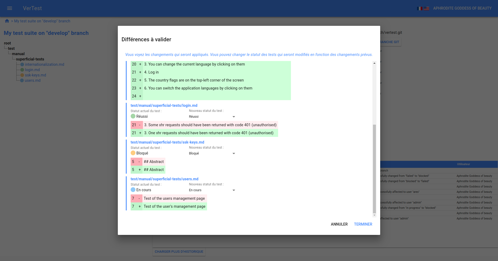

# Gérer une modification GIT sur les fichiers de test

## Visualiser la présence de modifications

Quand vous êtes sur la home page (avec la grille des suites de tests), si une suite de tests nécessite
une action de votre part, un symbole rouge apparaît sur la ligne correspondante :

En accédant à la page de la suite de tests, vous pouvez voir un symbole similaire dans le panneau
GIT, dans le coin supérieur droit du dashboard :

En cliquant sur ce symbole vous ferez apparaître la fenêtre de résolution.

## Résolution

Sur la fenêtre de résolution, chaque plan de test modifié apparaît, et vous pouvez visualiser les 
modifications à la façon d'un différentiel GIT.

Chaque plan de test a aussi son statut affiché, vous pouvez donc modifier ce statut.

Dans notre exemple, le premier plan de test `internationalization.md` a beaucoup de différences entre sa
version courante et la suivante. Nous devrions probablement changer son statut pour que ce plan de 
test soit rejoué entièrement.

A contrario, d'autres plans de test ont probablement été modifié pour corriger des fautes de frappe,
cela n'impacte pas leur statut.

Il semble que `ssh-keys.md` et `users.md` n'ont que des modifications mineures, contrairement à `login.md`.
Ce dernier a une modification qui apporte une précision importante, par conséquent on devrait basculer son
statut de `Réussi` à `A faire` ou `En cours`.

> Note : les fichiers ajoutés ou supprimés apparaissent dans deux onglets séparés, et il est
> impossible de modifier leurs statuts : les fichiers ajoutés auront automatiquement le statut
> par défaut.

## Dernière étape

Quand vous êtes satisfaits des nouveaux statuts, vous pouvez cliquer sur le bouton `Terminer`, les nouveaux
statuts seront automatiquement propagés, et le repository GIT sera mis à jour sur le dernier commit.
