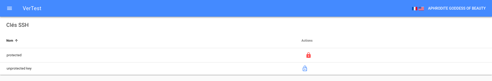

# Gestion des clés SSH

Il existe un moyen très courant d'accéder à un repository GIT : l'utilisation de clés SSH. 

Les clés SSH reposent sur le principe des clés asymétriques, donc quand vous générez une paire de clés,
une est publique et l'autre est privée.
La clé publique peut être diffusée à n'importe qui ou sur n'importe quel serveur, par contre la clé privée
doit rester secrète et protégée.
C'est pourquoi la plupart du temps elle est protégée par mot de passe.

Cette méthode d'authentification vous permet de tirer et pousser des commits sur un repository GIT seulement si :

* vous détenez et avez déprotégé la clé privée SSH
* le propriétaire a envoyé la clé publique correspondante sur le repository

Le protocole sécurisé SSH requiert la paire de clés privée - publique, mais il ne serait pas recommandé
de copier la clé privée dans le dossier de VerTest.

## Où suis-je censé stocker mes clés SSH ?

Dans la plupart des cas, et particulièrement sur les systèmes Linux, les clés se trouvent dans
`/home/[YOUR USER]/.ssh/`. Il est fortement recommandé de ne pas copier les clés en dehors de ce dossier.

Pour référencer ces clés dans VerTest, il suffit de modifier le fichier de configuration comme expliqué 
[dans la section configuration](configuration.md).

La seule chose dont vous devez vous soucier c'est de faire en sorte que l'utilisateur système qui exécute
VerTest ait le droit de lecture sur ces clés.

## Ma clé privée est protégée par mot de passe, dois-je en faire une copie déprotégée ?

Non, c'est absolument contraire aux usages. VerTest affichera un cadenas rouge sur la ligne de la clé SSH
concernée, et en cliquant dessus vous pourrez entrer son mot de passe.

> Note : pour résuire les risques de fuite, le mot de passe n'est pas stocké en mémoire,
> ce qui signifie qu'à chaque redémarrage de l'application vous devrez à nouveau entrer le mot
> de passe de la clé pour pouvoir l'utiliser.
