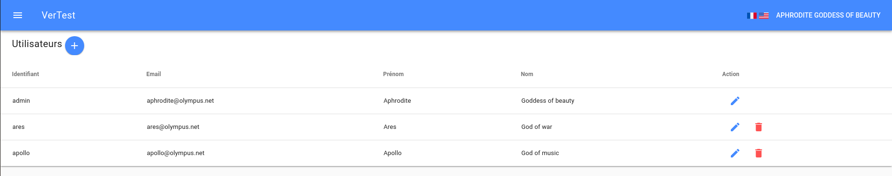

# Comment gérer les utilisateurs ?

La page de gestion des utilisateurs se trouve à `http://[server-host]/#/[lang]/users`

Le premier utilisateur est le super admin, il ne peut pas être supprimé.
Il peut modifier et supprimer d'aurtres utilisateurs, et bien entendu en créer de nouveaux.

Les autres utilisateurs peuvent uniquement modifier leurs propres informations.

Chaque utilisateur peut être en lecture seule, ce qui signifie qu'ils ne peuvent que consulter les 
informations affichées. La seule chose qu'ils peuvent éditer sont leurs propres informations.
