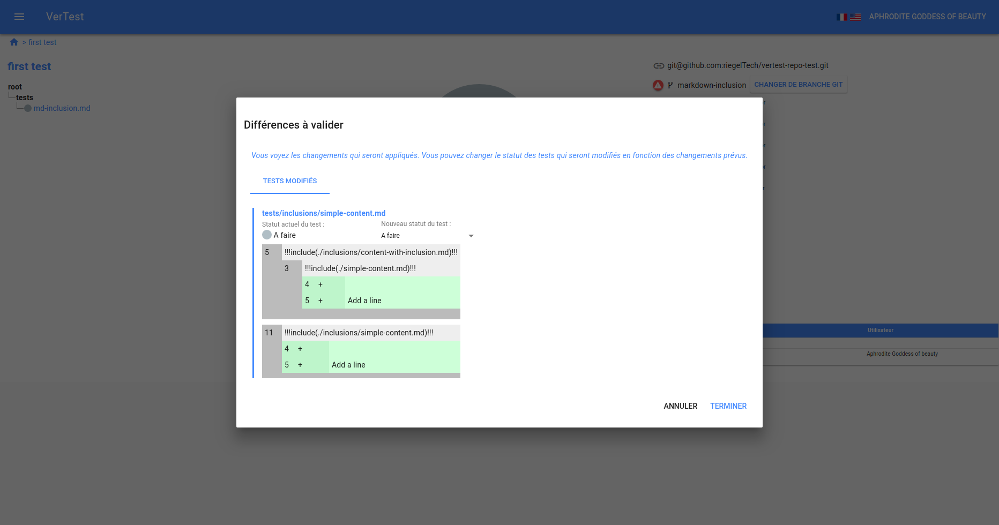

# Templatiser les plans de test

VerTest supporte une syntaxe Markdown permettant d'inclure des fragments provenant d'autres
fichiers Markdown. Ceci est basé sur le module [Markdown-it-include](https://github.com/camelaissani/markdown-it-include) module.

A l'inverse du module original, vous ne pourrez pas configurer la syntaxe du bloc d'inclusion, elle
devra impérativement être sous cette forme :
```md
!!!include([chemin relatif vers le fichier à inclure])!!!
```

Quand vous avez des parties communes à plusieurs plans de tests, vous pouvez donc les templatiser avec
cette technique.
Le premier avantage c'est que cela augmente la maintenabilité des plans de test en évitant les répétitions.

Vous n'avez pas à vous soucier de sélectionner ces fragments dans les fichiers trackés par la suite
de tests, excluez donc ces fichiers afin de ne pas être pollué par des fichiers inutiles si pris isolément.

## Qu'en est-il des modifications GIT sur ces fichiers ? ?

Quand une modification impacte l'un de ces fragments, et si le fragment est relatif à un plan de test, 
alors VerTest vous notifiera de la même manière qu'une modification sur un plan de test.
([voir la section sur les modifications GIT](git-modification.md)).

VerTest affichera le différentiel dans un mode récursif :



Dans cet exemple, le fichier `tests/inclusions/simple-content.md` est inclus deux fois :
1. dans `./inclusions/content-with-inclusion.md` à la ligne 5
2. dans `./inclusions/simple-content.md` à la ligne 11

Le fichier `./inclusions/content-with-inclusion.md` inclut aussi `./simple-content.md` à la ligne 3.

Donc si j'ajoute une ligne à la fin de `./inclusions/simple-content.md`, le différentiel obtenu va
indiquer que le plan de test `tests/inclusions/simple-content.md` a deux modifications :
1. à la ligne 5 via `./inclusions/content-with-inclusion.md` qui inclut `./inclusions/simple-content.md` à la ligne 3
2. à la ligne 11 par l'inclusion de `./inclusions/simple-content.md`

## Récursion

Le système d'inclusion est récursif, vous pouvez inclure des fragments dans d'autres fragments.

## Les types de fichiers qui peuvent être inclus

Il n'y a pas de limitation sur les types de fichier que vous pouvez inclure, cela permet de profiter
pleinement de la syntaxe Markdown, par exemple :

```md
\`\`\`json
!!!include([chemin relatif vers un fichier JSON])!!!
\`\`\`
```
