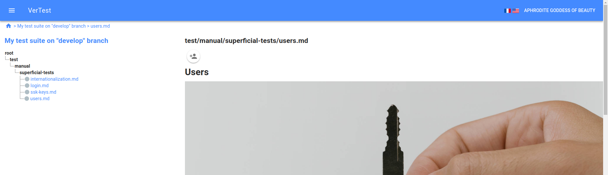
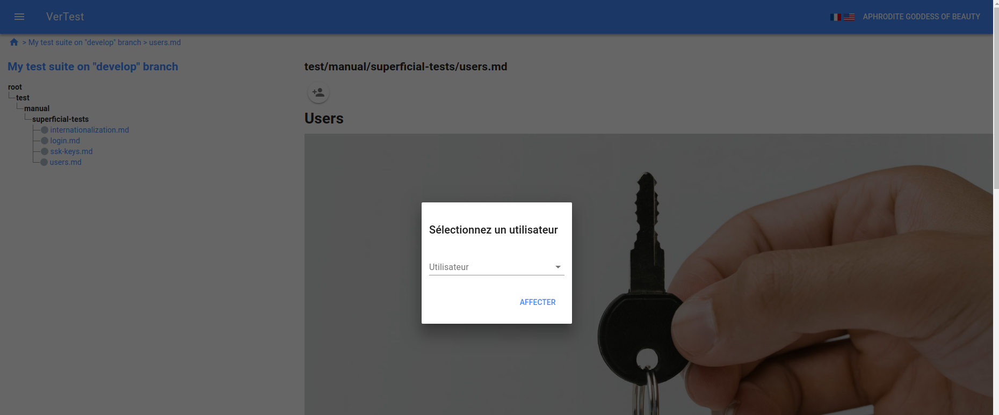
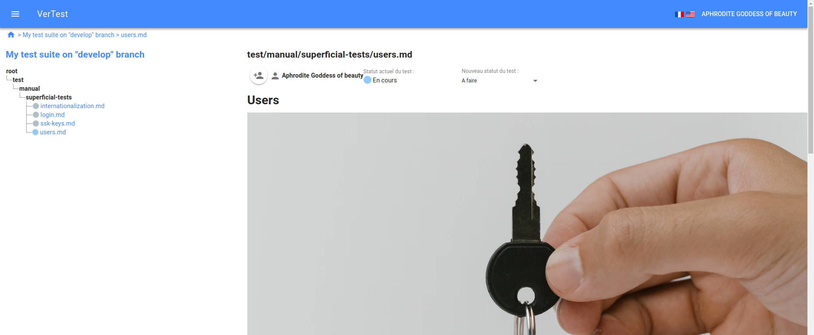

# Consulter et valider un plan de test

## Affecter un utilisateur sur le plan de test

Avant de modifier le statut d'un test, vous devez affecter un utilisateur à celui-ci, à l'aide du bouton
situé juste en dessous du nom du fichier.

> Note : quand vous affectez un utilisateur à un test, celui-ci bascule automatiquement du statut
> par défaut au statut suivant.

## L'utilisateur peut modifier le statut du plan de test

Une fois l'utilisateur affecté, il peut (et lui seul peut le faire) modifier le statut du plan de test.

