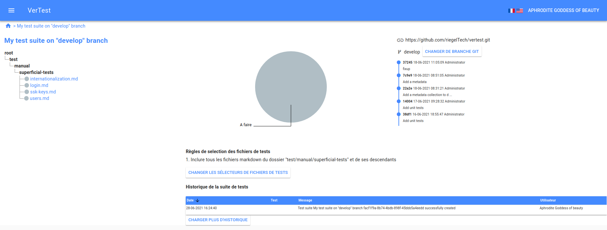

# Les pages des suites de tests

Lorsque vous cliquez sur une suite de tests, vous accédez au dashboard correspondant à celle-ci.

## L'arborescence des fichiers de test

Sur la gauche se trouve l'arborescence des fichiers de test, chaque fichier correspondant
à un plan de test.

A gauche de chaque nom de fichier figure l'état du plan de test sous forme de pastille colorées,
conformément à la [configuration des statuts de test](configuration.md).

Pour consulter un plan de test, cliquez simplement dessus.

## Graphique d'avancement'

Le graphique en camenbert représente la proportion de chaque statut parmi tous les plans de test.

## Le panneau d'information GIT

A droite de ce graphique se trouvent les informations relatives au repository GIT : 
* le log avec les derniers commits
* l'adresse du repository
* la branche GIT courante

Vous pouvez ainsi controller que le repository GIT est à jour.

## Les sélecteurs de fichiers

Le panneau "Règles de sélection des fichiers de test" affiche les sélecteurs actuellement utilisés.
Vous pouvez ainsi controller l'adéquation entre les fichiers affichés dans l'arborescence et les
séléecteurs.

## L'historique de la suite de tests

En pied de page se trouve une portion des derniers logs relatifs à la suite de tests.
