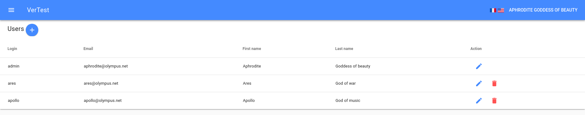

# How to manage the users ?

Users management stands on `http://[server-host]/#/[lang]/users`

The first admin is super-admin, and cannot be deleted. He can modify or delete all the other users,
 and obviously create new ones.

Other users can only edit their own information. They cannot create new users nor delete existing users.

Each user can be read-only, that means that he can only see the information on the application. The only
 thing they can edit is their own user's information.
