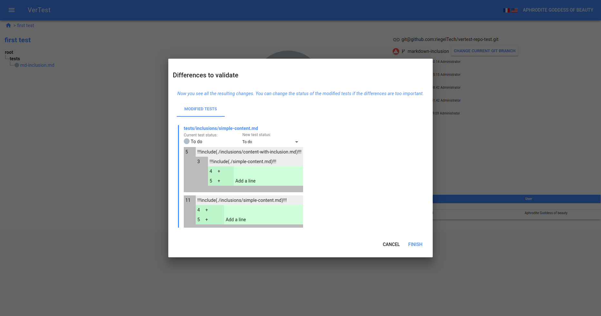

# Templatize your tests

VerTest supports a markdown syntax to include files as document fragment, based on the
[Markdown-it-include](https://github.com/camelaissani/markdown-it-include) module.

Unlike the original module, you cannot configure the syntax of the inclusion block, it has to be
in the form of:
```md
!!!include([relative path to the included file])!!!
```

When you have common parts across your tests, you can so templatize them. First advantage 
for you is to increase the maintainability of the tests, avoiding repetitions.

You should not add the fragments to the test suite, so you should exclude the corresponding
files in the file selector to keep a clean file tree and avoid unused test cases.

## What about the GIT modifications tracking ?

When a modification occurs on such fragment, and if the fragment relates to a test file, 
VerTest will notify you exactly the same way it does for a modification of a test file
([See the GIT modification section](git-modification.md)).

VerTest will display the resulting diff in a recurse way:



In this example, the file `tests/inclusions/simple-content.md` has two inclusions:

1. `./inclusions/content-with-inclusion.md` at line 5
2. `./inclusions/simple-content.md` at line 11

The file `./inclusions/content-with-inclusion.md` also includes `./simple-content.md`
on line 3.

So if I add a line in `./inclusions/simple-content.md`, the resulting diff indicates that the test
`tests/inclusions/simple-content.md` has two modification :

1. On line 5 via the file `./inclusions/content-with-inclusion.md` that includes 
   `./inclusions/simple-content.md` on line 3
2. Directly on line 11 via `./inclusions/simple-content.md` inclusion

## Recursion

The inclusion system is recursive, you can include a fragment that includes another, and so on...

## Type of files that can be included

There is no limitation on the type of file you can include, so it is possible to do such powerful tricks:

```md
\`\`\`json
!!!include([relative path to the JSON file])!!!
\`\`\`
```
