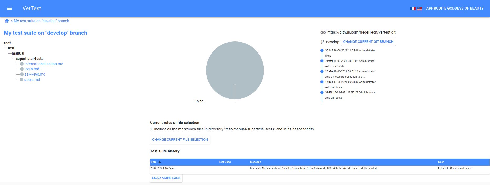

# The test suite page

When you click on a test suite you can see the test suite's dashboard.

## Test cases tree

On the left you can see the file tree of the test cases (each test case is a markdown file).

At the left side of the filename, the test status is displayed as a coloured spot, corresponding
to the status color (see [the statuses configuration page](./configuration.md)).

To read a test case, simply click on its name.

## Progress chart

The big pie chart represents the total test cases number of each status.

## The GIT information

At the right side, you can see all GIT information, like the repository address, the GIT log,
and the current GIT branch. You can control that the test suite is up-to-date.

## The file selector

The panel "Current rules of file selection" displays the selector that is currently used: 
you can control that you correctly selected all the wanted files in the file tree.

## The tes suite history

On the bottom of the page you can see the an extract of the logs related to the current test suite. 