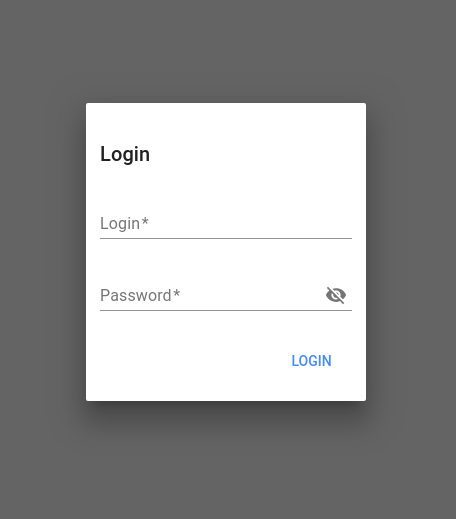

1. The login popin is displayed over a transparent grey layout mask
   
2. No data is displayed under this layout
3. Enter the correct login and password and submit
4. Login popin should disappear and the test suites tables should appear and populate with data (if any)
5. User's first name and last name are displayed on the top left screen, in the header