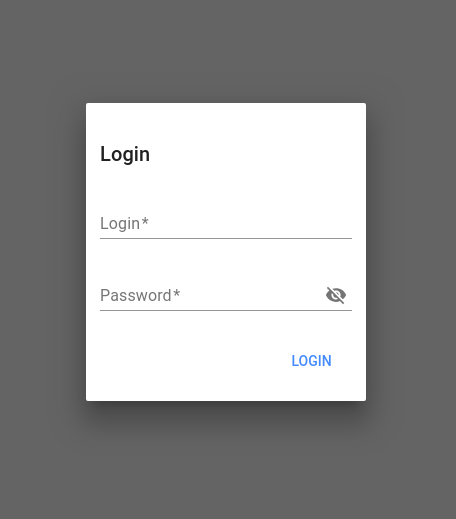

# Login

## Abstract

Test the login form, the login, logoff procedure and other displays involved.

## Prerequisites

1. App is running
2. You are not logged in
3. Get a browser, open the developments tools, and open the network panel

## test

### When not logged in

1. Go to http://[serverName]/
2. You should be redirected to http://[serverName]/#/
3. Some xhr requests should have been returned with code 401 (unauthorised)
   
4. The login popin is displayed over a transparent grey layout mask
   
5. No data is displayed under this layout

### Login errors

1. Submit the form as is
2. An error message should appear with a clear explanation about what goes wrong
3. Each field turned to red color with an explicit error message
   
4. Fill the login field
5. Submit the form as is
6. All error messages remains except the login field one
7. Fill the password field with an invalid password ans submit
8. The error message on the password field should disappear

### Login success

1. Enter the correct login and password and submit
2. Login popin should disappear and the test suites tables should appear and populate with data (if any)
3. User's first name and last name are displayed on the top left screen, in the header
4. Click on it
5. A panel should appear from right, containing the user's first name and last name, and a logout icon
6. Click on the logout icon
7. You should be on the initial state: "When not logged in"

### Logs

1. Open the log info file in the project's log directory
2. The login / logoff actions and the failed attempts should be properly logged
