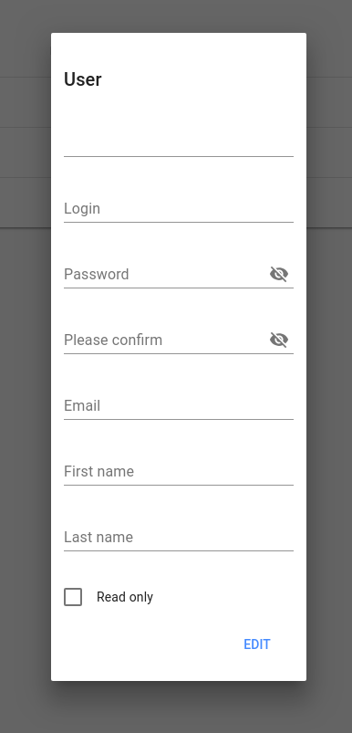

# Users

## Abstract

Test of the users management page

## Prerequisites

1. App is running
2. Two users are configured: 
   - super admin
   - a read-only user
2. You are logged in as super admin

## Test

### First display

1. Go to http://[serverName]/#/users
2. You should see a grid containing two users
3. All users should be editable, including the super admin
4. All users should be removable, except super admin (current connected user)

### Creation

1. Click on the "add" button (top left corner of the screen)
2. A popin should appear
   
3. Fill the fields in order to create a new user
4. Validate
5. The new user should appear on the grid

### Modification

1. Edit one of the users
2. Same popin should appear, filled with the users's information
3. Modify these information
4. Validate
5. The user should have been updated in the grid

### Read only

1. Logoff and login with a read-only user
2. Go to http://[serverName]/#/users
3. The only user that is editable is the current one
4. No deletion is possible
5. No addition is possible
